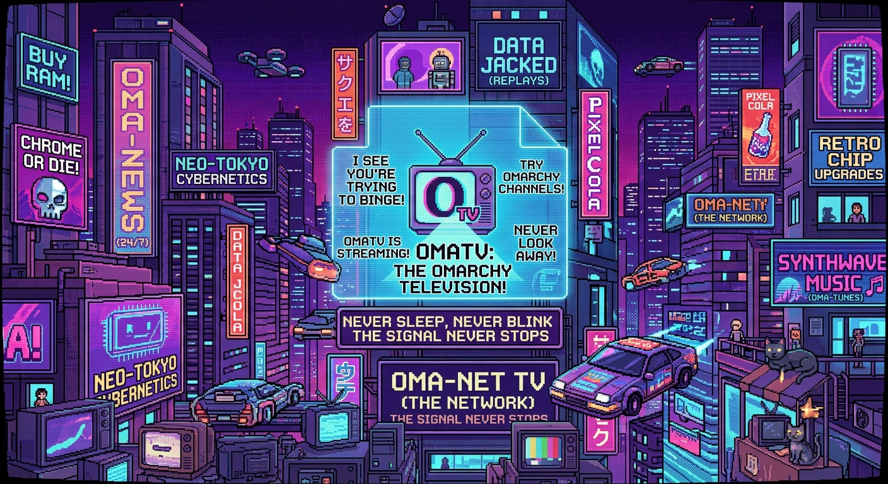
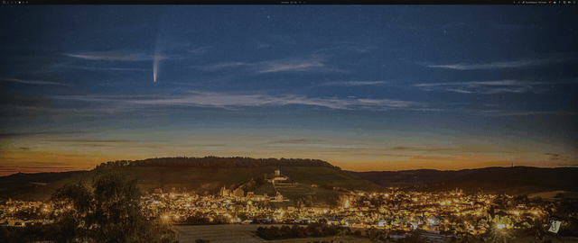

# OMATV 📺



Someone looked at a tiling window manager and said "you know what this minimal, keyboard-driven, terminal-pure setup is missing? *Live television.*" That someone was me. Nobody asked. It's here anyway.

**OMATV** turns your Omarchy desktop into the laziest couch experience this side of a tiling WM: fuzzy-search thousands of IPTV channels from combined m3u playlists, hit enter, and `mpv` takes over your screen in fullscreen. No Electron. No browser engine quietly eating 2GB of RAM. Just QML, curl, and regret at 3am watching infomercials.



## 🛠️ Requirements & Dependency Lore

```bash
# The player. If you don't have mpv installed, what are we even doing here.
sudo pacman -S mpv

# Playlist fetching. Already on basically every system, but just in case:
sudo pacman -S curl
```

That's it. Two things you probably already had. The bar is on the floor and still nobody else stepped over it.

## 🚀 Quickstart

Enable the plugin and restart the shell:

```bash
omarchy plugin enable dev.ebbo.omatv
omarchy-restart-shell
```

Click the **TV** icon in your status bar to summon the overlay, or do it programmatically like a person who fears mice:

```bash
omarchy-shell shell toggle dev.ebbo.omatv
```

Type a few letters — "bbc", "ger news", whatever — pick a channel, and enjoy the full-screen glory. Star your favorites, add your own playlists, judge the iptv-org catalog's life choices.

## ⚙️ Architecture & Channel Flow

```
  [ m3u Playlists ] ---> curl ---> Service.qml ---> Model.js (parse + index)
                                        |                   |
  [ Bar Widget Click ] ---------------->+          [ fuzzy subsequence scores ]
                                        |                   |
                                  Overlay.qml <-------------+
                                        |
                                  [ Enter ] ---> mpv --fs (fullscreen bliss)
                                        |
                              [ ♥ favorites + config.json ]
```

- **Service.qml** — the brains: fetches playlists via `curl`, persists favorites/playlists to config, and spawns `mpv` when you commit to a channel.
- **Model.js** — the pure, testable core: m3u parsing, URL hygiene, and a fuzzy scorer that ranks "cnn" above "Cartoon News Network" (debatable).
- **Overlay.qml / OverlayWindow.qml** — the looks: fullscreen fuzzy-search UI with logos, groups, tabs for All/Favorites.
- **BarWidget.qml** — the doorbell: one TV icon between you and 10,000 channels.

## 🧪 Testing

Want to verify the playlist parsing and fuzzy logic without accidentally watching a 24/7 fireplace channel? Run the zero-dependency test suite:

```bash
node tests/model.test.js
```

---

*Disclaimer: `dev.ebbo.omatv` is provided as-is. Not responsible for lost evenings, "one more episode" syndrome, or discovering that channel 8,412 is exclusively Bulgarian folk music.*
